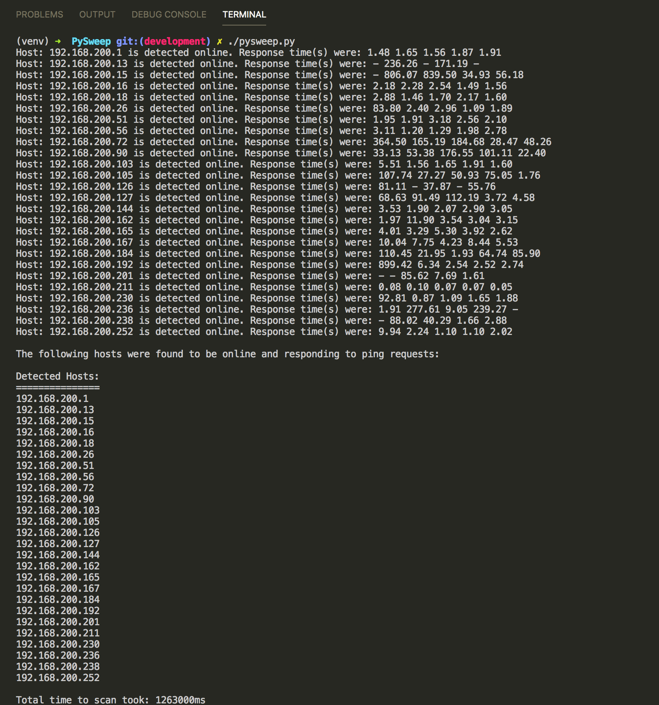

# PySweep

A command line utility to automate and capture the results of a ping sweep across a network.

[PySweep Instructions](https://gist.github.com/jaywon/ffa93b22fbb83a0b132112630e1dfec1)

#### Setup pysweep.py To Be Executable

* [Create project in a virtual environment](https://github.com/jocelynsaysrawr/python-virtual-environment-notes)
* `#!/usr/bin/env python`
    * Set this at the top of your file to ensure the interpreter used is the first one in your environment's $PATH 
* `chmod u+x pysweep.py`
    * Change user permissions to make file executable

Now you can run the script by calling `./pysweep.py` in the terminal.

#### Part 1 Results:

